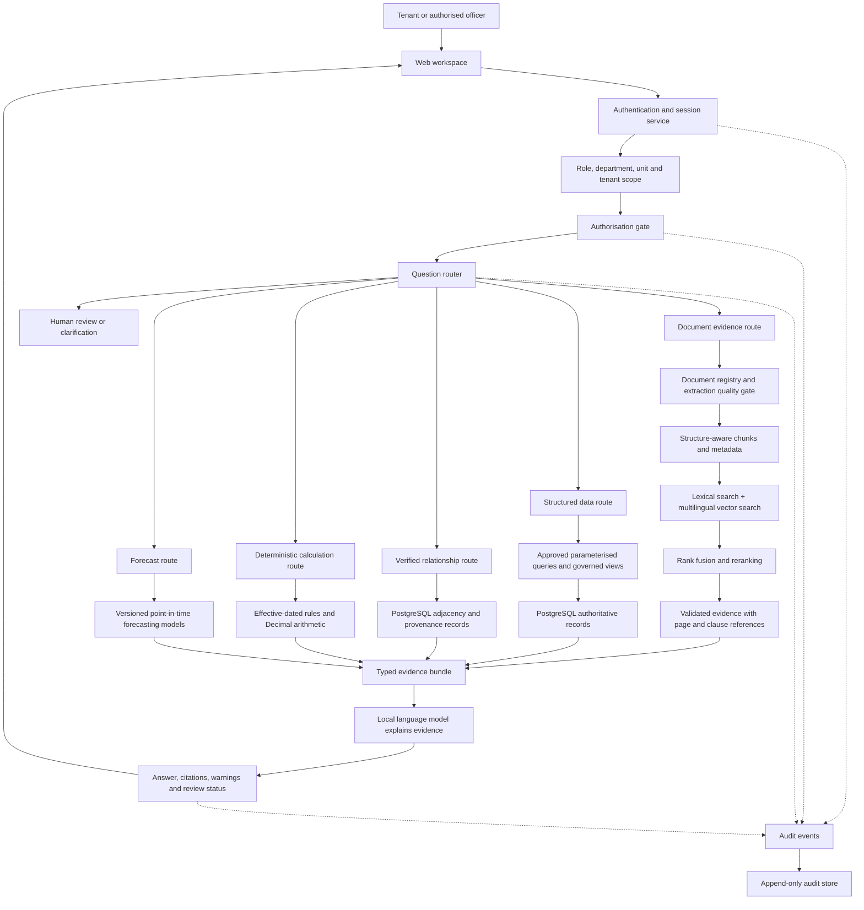

# AI-Powered Port Land Lease Management System

## Overview

### Current conversational workspace status

The source tree now includes the Phase 3 persistent chat workspace: the
assistant can create, list, open, rename and archive database-backed personal
or shared-case chats, and the React workspace can display restored chat
messages, citations, attachments and memory records. Phase 4 also guards the
real streaming policy route against overlapping requests and provides a
browser Stop action. The migration
`db/migrations/versions/20260806_0016_persistent_chat_workspace.py` is still
pending explicit live review; no chat tables are assumed to exist until it is
applied. See `docs/PHASE_3_NEW_CHAT_HISTORY.md` and
`docs/PHASE_4_SINGLE_ACTIVE_REQUEST.md` for the validated boundary.
Phase 5 adds allowlisted, accessible activity indicators and controlled retry
states; see `docs/PHASE_5_THINKING_PROGRESS.md`.

The AI-Powered Port Land Lease Management System is a local, auditable
assistant for port authorities, estate officers and tenants. It brings policy
documents and operational lease data into one controlled workspace so that a
question that previously required manual searching across offices, registers
and documents can be answered in minutes or hours.

The system is designed for evidence-based assistance, not autonomous
decision-making. It retrieves authorised evidence, preserves the source of
each fact, performs exact calculations with deterministic software, and asks
for human review when evidence is missing, conflicting or low quality.

## Aim

To reduce the time and manual effort required to find, verify and explain
port-land lease information while preserving government-grade security,
traceability, role separation and decision accountability.

## Objectives

1. Provide one conversational workspace for policy, Act, circular, agreement
   and operational-data questions.
2. Return answers grounded in approved documents or authoritative database
   records, with citations and page or record references where available.
3. Allow a Data Entry Operator to begin a case and transfer the complete,
   bounded context to a Nodal/Regional Officer and then to the HOD.
4. Prevent a handoff from losing the original question, evidence, remarks,
   decisions or unresolved issues.
5. Give tenants access only to their authorised information.
6. Give authorised officers access according to their assigned duties, never
   according to a frontend-only flag.
7. Keep rent, tax, penalty and escalation calculations reproducible and
   independent of generative AI.
8. Preserve audit records for questions, retrieval, calculations, handoffs,
   approvals and refusals.
9. Support English, Hindi and Marathi documents, including mixed-language
   pages, subject to extraction-quality review.
10. Run locally or on-premises without requiring a cloud data service.

## Business problem

Port land administration combines structured records, scanned agreements,
policy documents, office orders, legal material, inspections, bills and
payment history. The information is difficult to use when it is distributed
across systems, uses legacy identifiers, contains tables and clauses, or is
written in more than one language.

The proposed assistant addresses the information-retrieval bottleneck. It
does not replace the officer who validates a record, interprets a legal
clause, approves a lease action or resolves conflicting evidence.

## Intended users and responsibilities

| Role | Primary responsibility | Typical access |
|---|---|---|
| Data Entry Operator | Create a case, enter initial facts and attach source material | Assigned operational work and case context |
| Nodal/Regional Officer | Review, correct and enrich the working case | Cases within authorised unit or region |
| HOD | Review the complete history and take the final workflow action | Department-level governed data and approvals |
| Tenant | Ask about the tenant's own authorised lease, bills and documents | Own records only |

The role names describe business responsibility. Actual access must be
enforced by server-side authentication, role and attribute checks, database
policies, document ACLs and audit logging.

## Core use case: sequential case handoff

1. The Data Entry Operator opens a case and asks a question.
2. The service classifies the request and retrieves only authorised evidence.
3. The operator records facts, references and unresolved questions.
4. The case is handed to the Nodal/Regional Officer with a bounded context
   capsule containing the timeline, prior messages, evidence references and
   pending actions.
5. The Nodal Officer continues from the last verified point, adds remarks or
   requests correction, and returns or forwards the case.
6. The HOD sees the same ordered history, evidence and decisions, then
   approves, returns or rejects according to authority.
7. Every transition and response is auditable.

This avoids restarting an investigation from the beginning at every desk.
The context capsule is deliberately bounded so that irrelevant or untrusted
conversation history does not silently become authority.

## Architecture



### Separation of responsibilities

- PostgreSQL is authoritative for tenants, plots, tenancies, leases, bills,
  payments, dates, statuses and exact numeric values.
- Document retrieval finds policy, legal, agreement and circular evidence.
- Relationship retrieval explains verified links such as tenant to tenancy to
  plot or inspection to notice to legal case.
- The rule engine calculates historical and current financial values using
  effective dates and decimal arithmetic.
- Forecasting estimates uncertain future quantities and always labels
  observed, imputed and predicted values separately.
- The local language model explains a validated evidence bundle. It is not an
  authority for access decisions, statutory rates or financial calculations.

## How a question is answered

### Document questions

For a policy or Act question, the service authenticates the user, applies
document ACL and effective-date filters, searches lexical and dense indexes,
combines their rankings, reranks a small candidate set, expands to the
relevant parent section, and validates the evidence. The language model then
receives only the validated passages and produces a cited answer.

This is a retrieval-augmented generation design. It follows the evidence-first
principle described by Lewis et al. in the original RAG work, while dense
retrieval is informed by DPR and candidate reranking follows the late
interaction motivation of ColBERT. A self-check or review state is preferred
to an unsupported answer when evidence is insufficient.

### Structured questions

For questions about bills, leases, payments, plots or units, the service uses
an approved semantic catalog and parameterised query templates. Natural
language may supply filters such as a year or date range, but it cannot supply
raw SQL, table names, arbitrary columns or database credentials. PostgreSQL
returns the exact values, and the response is rendered as readable text with
the query intent, scope and source label.

The current safe implementation is governed-view access, not unrestricted
natural-language SQL over every raw extraction table. Extending coverage
requires reviewing and approving additional views and their sensitive-column
policy.

### Hybrid questions

Some questions require both a database fact and a document explanation. The
router combines the exact structured result and the cited document evidence
into one typed bundle. If the sources disagree, the response reports the
conflict and requests review rather than choosing silently.

## Data lifecycle

```text
Source database and approved documents
        ↓
Validated ingestion and document registry
        ↓
Canonical identifiers, quality results and provenance
        ↓
Structure-aware chunks for narrative evidence
        ↓
Multilingual embeddings and lexical indexes
        ↓
Authorised retrieval or exact governed query
        ↓
Validated evidence bundle
        ↓
Grounded text answer, citation, warning and audit event
```

Structured values are not embedded indiscriminately. Identifiers, dates,
amounts, tax rates, passwords and personal data remain exact database fields.
Only reviewed narrative material such as clauses, remarks and inspection
observations is considered for semantic indexing, with source metadata and
access scope preserved.

## Security and trust model

Security is applied before retrieval and before database access:

1. central authentication or the explicitly controlled local development
   identity;
2. role and attribute-based authorisation;
3. database permissions and row-level policies;
4. approved views and parameterised queries;
5. document and vector metadata ACLs;
6. output validation, citation checks and audit logging.

Uploaded document text is untrusted input. Instructions inside a document are
treated as content, not as commands. The system must never expose unrestricted
SQL, credentials, raw tenant data or hidden system prompts to a browser user.

## Technology choices

- PostgreSQL and pgvector: authoritative relational records, full-text search,
  vector retrieval and audit-friendly transactions.
- FastAPI and typed validation: explicit API contracts and server-side policy
  enforcement.
- React: a responsive workspace for tenant and officer workflows.
- MinIO: local object storage for original documents and derived artifacts.
- Keycloak or an approved equivalent: centralized identity and role claims.
- OpenDataLoader PDF with reviewed fallbacks: digital, scanned and mixed
  document extraction.
- BGE-M3 and a multilingual reranker: shared English, Hindi and Marathi
  retrieval space.
- A local Qwen-class language model: private explanation of verified evidence.
- Alembic and Docker Compose: repeatable local infrastructure and migrations.
- CatBoost and statistical time-series models: bounded forecasting with
  rolling validation rather than unsupported neural complexity.

## Current delivery status

The project has established the principal application architecture, typed API
and React integration, governed structured-query boundaries, document
registry and parsing contracts, chunking and embedding contracts, retrieval
and citation contracts, role-aware workflow models, effective-dated rule
contracts, forecasting contracts, graph provenance contracts, audit support,
local infrastructure definitions and extensive unit/security tests.

A controlled local demonstration path exists for showing the question-routing
and authorised read-only workflow. It is intentionally narrower than a
production-wide assistant and is disabled by default.

The current evidence boundary must be stated honestly:

- the extracted operational source is historical and does not automatically
  contain records after its source period;
- not every raw extraction table is exposed to conversational access;
- document indexing is partial and extraction quality varies by PDF;
- representative scanned, multilingual and table-heavy evaluation evidence
  still requires approved samples and review;
- live identity-provider validation, production deployment, capacity testing
  and broad client acceptance remain release gates;
- a review-required response is a correct safety outcome, not a failed answer.

## Remaining work before production

1. Confirm the authoritative database snapshot, retention period and approved
   governed views for each business question.
2. Complete legally approved representative-document evaluation across digital,
   scanned, multilingual and table-heavy cases.
3. Finish live identity, role, row-level and document-ACL validation in the
   target environment.
4. Expand structured coverage only through reviewed views and parameterised
   templates; never expose raw unrestricted text-to-SQL.
5. Complete end-to-end case handoff tests with realistic but approved data.
6. Benchmark retrieval latency, extraction throughput, model memory and
   concurrent users on the selected deployment hardware.
7. Validate citations, conflict handling, review queues, audit retention,
   backup/restore and incident response.
8. Package versioned models, migrations, configuration templates and a clean
   deployment runbook for the target environment.
9. Obtain business-owner acceptance for accuracy, workflow usability and
   permitted data scope.

## Definition of a successful pilot

The pilot is successful when an authorised user can:

- sign in through the approved identity path;
- open a case and continue it across Data Entry Operator, Nodal/Regional
  Officer and HOD roles;
- ask a policy question and receive a cited, source-grounded answer;
- ask an approved operational question and receive exact text-form values;
- see a clear refusal for unauthorised or destructive requests;
- observe the corresponding audit event;
- reproduce a deterministic financial calculation;
- receive `REVIEW_REQUIRED` for missing, conflicting or low-quality evidence.

## Research grounding

The design is informed by the following primary research:

- [Retrieval-Augmented Generation for Knowledge-Intensive NLP Tasks](https://arxiv.org/abs/2005.11401), Lewis et al., 2020.
- [Dense Passage Retrieval for Open-Domain Question Answering](https://arxiv.org/abs/2004.04906), Karpukhin et al., 2020.
- [ColBERT: Efficient and Effective Passage Search via Contextualized Late Interaction over BERT](https://arxiv.org/abs/2004.12832), Khattab and Zaharia, 2020.
- [Self-RAG: Learning to Retrieve, Generate, and Critique through Self-Reflection](https://arxiv.org/abs/2310.11511), Asai et al., 2023.

These papers motivate retrieval, dense matching, reranking and evidence
reflection. They do not replace domain validation, access control, legal
review or deterministic database and rule-engine design.

## Project principle

The system should answer quickly when authorised evidence is strong, explain
where the answer came from, preserve the complete case history, and stop for a
human whenever the evidence is not sufficient. That balance—speed without
invented certainty—is the central design objective.

## Complexity assessment and active pilot scope

The repository contains more capability than is required for the first client
demonstration. Authentication alternatives, controlled-demo routing, document
RAG, structured queries, graph provenance, forecasting, rules and workflow
services are separate boundaries, but they are not all required to prove the
primary value proposition at the same time.

For the pilot, validate one vertical slice first:

```text
Approved login → role-authorised assistant → /api/v1/policy/query
→ OpenDataLoader and quality gate → protected chunks
→ lexical + dense retrieval → rank fusion → reranking
→ Qwen grounded generation → citation validation
→ answer, source PDF/page, review state and audit event
```

Graph, forecasting, advanced handoff and controlled-demo features may remain
in the repository, but should stay disabled or outside the pilot script until
the core slice is proven. They must not silently replace the real document
route.

The pilot is not proven by a UI readiness banner alone. Before presenting an
indexed-PDF answer, verify live counts in `pms_doc.document_record`,
`pms_vector.document_chunk`, `pms_vector.chunk_embedding` and
`pms_vector.chunk_acl`, and confirm that the authenticated account is
authorised for those chunks. A checkpoint file or an earlier “indexed” result
is not proof that rows currently exist in the configured database.

This is an operational simplification, not a security shortcut. ACL/RLS,
citation validation, audit logging, quality gates and read-only database
boundaries remain mandatory.
